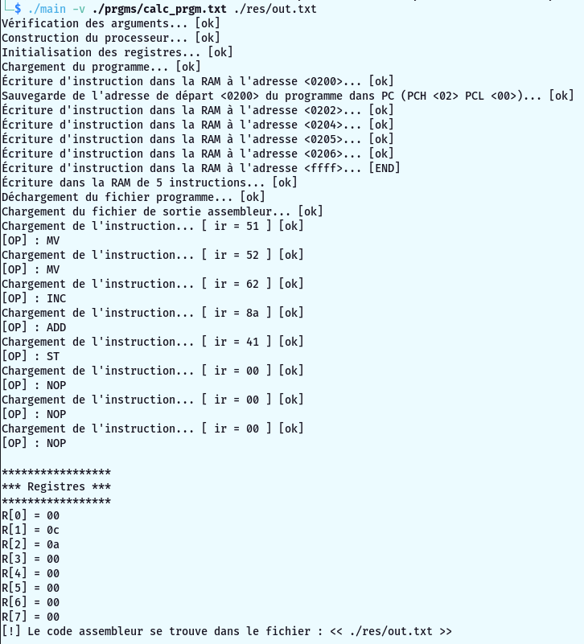

> TP Archi rendu 1

# Présentation

Le but de ce tp est de simuler un processeur.

Le programme prend un fichier contenant les instructions au format "**adresse : instruction_hex**", il lit ce fichier et décode chacune des instructions pour l'éxécuter. Les instructions décodées sont ensuite sauvegarder dans un fichier.

# Programme d'entrée

> format : **HHLL: AA BB CC**

*Pour des raisons de lisibilité les addresses sont données sous forme HHLL et non LLHH !*

L'éxécution du programme engendrera sur le fichier de sortie : le code assembleur.

# Structure du projet

## Processeur

La structure du processeur est déclarée dans le fichier **proc.h**, elle est définie dans le fichier **proc.c**.

Elle correspond au schéma dans le sujet de tp, c'est-à dire que les registres, bus, ram, alu, etc... sont représentés par des octets (type -> *byte**).

Les signaux sont représentés par des fonctions tout comme les micro-instructions de l'ALU.

## Operations

Les opérations ASSEMBLEUR sont déclarées dans le fichier **operations.h** et sont définies dans le fichier **operations.c**.

Chaque opérations est représentée par une structure et possède une fonction qui lui est propre, son appelle correpond à son exécution.

Le décodage est effectué dans **operations.c**. Il permet de savoir qu'elle opération doit être appeler selon le code d'instruciton donné (c'est le registre IR du processeur).

## Parser

Le parser permet de charger le programme donné dans la ram du processeur.

## Debug

Fonctions permettant d'arrêter le code à chaque instructions et d'éxécuter une liste de commandes.
Le but étant d'éxécuter pas à pas le programme tout en ayant accés aux différentes valeurs du processeurs (registres, alu, bus, etc...).

## Main

Contient l'entré du programme, tout est géré ici.

# Utilisation

## Mode simple

>Compilation :
>    * $ **make**

>Lancement du programme :  
> * $ **./main [-debug] [-v] \<fichier_prgm\> \<fichier_sortie_assm\>**
>
> exemple : ./main -v ./my_prgm.txt ./res/out.txt

> Options :
>>   **-debug** : Permet de décoder pas à pas le programme et d'afficher les variables du processeur.  
>>   **-v** (verbose) : Affiche plus d'informations dans la console.

**Appuyer sur entrer** pour éxécuter l'opération suivante.

Le programme se termine automatiquement lorsqu'il lit 3 opérations NOP.

Vous retrouvez le code assembleur du programme dans ./res/out.txt

### Voici quelques exemples d'utilisation :

**Exécution simple**

**Fichier de sortie assembleur**

## Mode debug

On lance la commande en spécifiant l'option **-debug**.

La liste de toutes les commandes du débuggeur s'affiche, ainsi qu'une invite de commande.

Appuyer simplement sur la touche *"entrée"* pour éxécuter la commande suivante.

Utiliser les commandes indiquer pour afficher des valeurs du processeur.

Vous pouver stopper l'éxécution du programme avec la commande *"quit"* ou *"q"*

*Note : pas de mode "points d'arrêt" comme indiqué dans le sujet **TP1.pdf** car on estime qu'arrêter l'éxécution du code à chaque instructions dispense l'utiilisation de cette fonctionnalité.*

**Exécution en mode débogage**

# Programmes

*Dans le dossier **./prgms/** !*

\# **my_prgm.txt** : Ce premier programme est celui du sujet.

\# **calc_prgm.txt** :

1. Met *2* dans *R1*
1. Met *9* dans *R2*
1. Incrémente *R2*
1. Additionne *R1* *R2* (résultat dans *R1*)
1. Stocke le résultat à l'adresse **#0213**